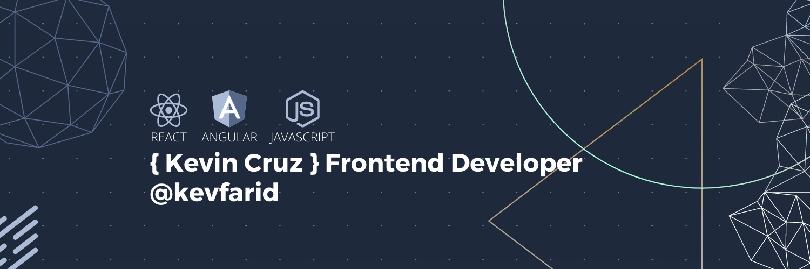

# 👋 &nbsp;&nbsp; Welcome. I'm Kev

With 5+ years of experience as a Frontend Developer, I lead frontend engineering at an innovative startup in its early stages, driving improvements and new feature development. My expertise spans web (Next.js, React, Angular, among others) and mobile applications, including cross-platform solutions with React Native and Ionic. I focus on delivering intuitive UI/UX, collaborating closely with users to create scalable, high-performance platforms. Proven in leading teams, optimizing deployments, and ensuring project success with modern frameworks and tools. I know that one day i'll change the world with my ideas 🖤

<!-- 🔭 &nbsp;&nbsp;&nbsp;I’m currently working at <a href="">/a> with Frontend Engineer  -->

🇨🇴 &nbsp;&nbsp;&nbsp;I'm from Bogotá, Colombia.

💬 &nbsp;&nbsp;Ask me about whatever you want. I'm interested in helping and sharing.

<!-- 📫 How to reach me:

&nbsp; &nbsp;  &nbsp; [ LinkedIn](https://www.linkedin.com/in/kevfarid/) -->

## 🎯 &nbsp;&nbsp;Some technologies I use:

  &nbsp;&nbsp;
  &nbsp;&nbsp;
  &nbsp;&nbsp;
  &nbsp;&nbsp;
  &nbsp;&nbsp;
  &nbsp;&nbsp;
  &nbsp;&nbsp;
  &nbsp;&nbsp;
  &nbsp;&nbsp;
  
  
  
  
  
  
  &nbsp;&nbsp;
  &nbsp;&nbsp;

## 🌎 &nbsp;&nbsp;Contact me:

  
  
  
  
</ p>

## 📈 &nbsp;&nbsp;Some of my stats are:

  
  

 

  

<!--
**KevFarid/KevFarid** is a ✨ _special_ ✨ repository because its `README.md` () appears on your GitHub profile.

Here are some ideas to get you started:

- 🔭 I’m currently working on ...
- 🌱 I’m currently learning ...
- 👯 I’m looking to collaborate on ...
- 🤔 I’m looking for help with ...
- 💬 Ask me about ...
- 📫 How to reach me: ...
- 😄 Pronouns: ...
- ⚡ Fun fact: ...
-->
